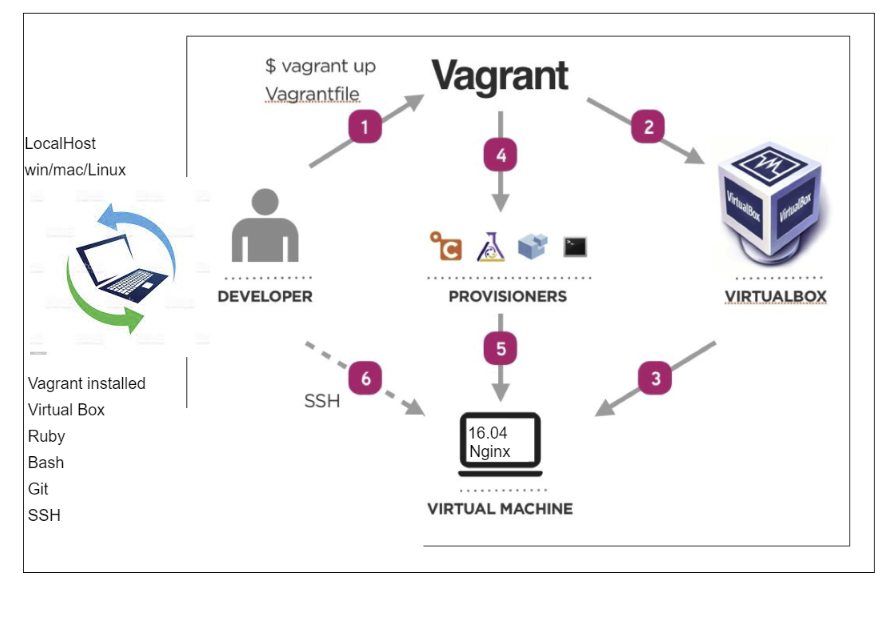
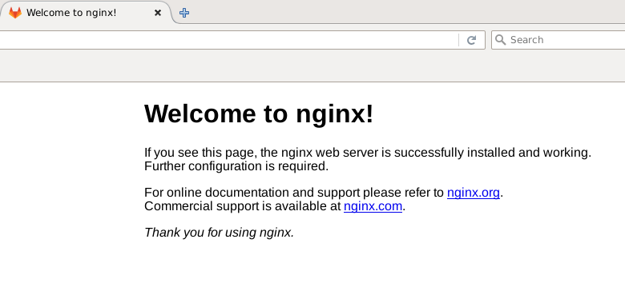
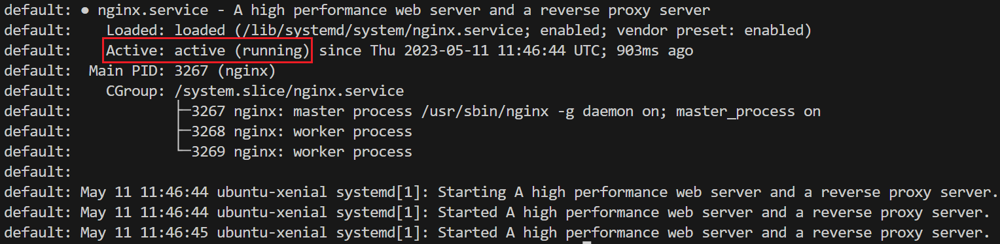

# Nginx Web Server Deployment using Vagrant

Vagrant is a tool for building and provisioning virtual machine environments. It makes the workflow easy to use and focuses on automation, lowering setup time and increasing overall productivity.



This guide will explain how to create an Ubuntu Virtual Machine (VM) using Vagrant and VirtualBox Manager, and use it to run an Nginx web server.

Pre-requisites (for Windows):

- Install VirtualBox and run as **administrator**: [Oracle VirtualBox 6.1](https://www.virtualbox.org/wiki/Download_Old_Builds_6_1)
- Install Vagrant (AMD64 recommended): [HashiCorp Vagrant](https://developer.hashicorp.com/vagrant/downloads?product_intent=vagrant)
- Check Vagrant is installed by entering `vagrant` into a terminal.
- Install VSCode and run as **administrator**: [Visual Studio Code](https://code.visualstudio.com/download)

## Creating the Virtual Machine using Vagrant

1. Firstly, open a Git bash terminal window in VSCode and navigate to the desired folder where you want to create the VM.

2. Initialise the folder for Vagrant using the following command:

    ```console
    $ vagrant init
    ```

3. This should produce a file called 'Vagrantfile' where all the configuration information will be stored. Open the file and remove the comments so it looks similar to the below:

    ```ruby
    Vagrant.configure("2") do |config|
    
      config.vm.box = "base"
    
    end
    ```

4. Where it says `base`, enter the VM image type, in this case we are using Ubuntu so enter `ubuntu/xenial64`.

5. Also, we want to specify the IP address of the Nginx web-server, so enter a new line under `config.vm.box` and type the following: `config.vm.network "private_network", ip:"192.168.10.100"`. Our 'Vagrantfile' should now look something like the below:

    ```ruby
    Vagrant.configure("2") do |config|
    
      config.vm.box = "ubuntu/xenial64"
      config.vm.network "private_network", ip:"192.168.10.100"
    
    end
    ```

6. Now, moving back to the terminal we can start the VM using the following command:

    ```console
    $ vagrant up
    ```

    If you open VirtualBox, you should now see the VM running, it should be titled the same as the folder you initialised it in.

    

7. To log in to the VM and use the VM's Linux terminal, enter the following command:

    ```console
    $ vagrant ssh
    ```

8. Now we are logged in, the username in the VSCode terminal should change to `vagrant@ubuntu-xenial` meaning you have successfully created and logged in to your new VM's Linux terminal! Now to deploy our first Nginx web server...

## Deploying the Nginx Web Server

1. Firstly, use the following Linux commands to fetch updates for any packages that can be installed (`update`) and install such updates (`upgrade`).

    ```console
    $ sudo apt-get update
    $ sudo apt-get upgrade
    ```

    > **Note:** ensure you want to install these updates as it may be dangerous to do so. `-y` can be added to the end of the `upgrade` command to automatically bypass the 'Do you want to continue? [Y/n]' warning. In any case, enter 'y' to move on.

2. Next, install Nginx which will be the software used to run the web server, using the command below:

    ```console
    $ sudo apt-get install nginx
    ```

3. To start the Nginx web server, we can use the following `start` command and to check the status of the server we can use the `status` command, as follows:

    ```console
    $ sudo systemctl start nginx
    $ sudo systemctl status nginx
    ```

    > **Note:** if your command line disappears at this step, it may be because a text editor is displaying the status information, press 'q' to exit this and return to the command line.

4. To log out of the VM's Linux terminal, you can use the following command:

    ```console
    $ exit
    ```

5. Congratulations, you have successfully deployed your first web server. Enter the IP address '192.168.10.100' in a browser address bar to view the following Nginx welcome page.

    

## Automating the Deployment

We will now automate all of the previous steps so when a `vagrant up` command is run, the VM will be provisioned with the Nginx web server and it will be automatically running.

1. Firstly, add a new line to your 'Vagrantfile' and call the `config.vm.provision` method which tells Vagrant to provision it when you create and start the VM. We want to provision it using a 'shell' script, called 'provision.sh' in this case, as shown below:

    ```ruby
    Vagrant.configure("2") do |config|
    
      # configure the VM settings
      config.vm.box = "ubuntu/xenial64"
      config.vm.network "private_network", ip:"192.168.10.100"

      # provision the VM to have nginx web server
      config.vm.provision "shell", path: "provision.sh"

    end
    ```

2. Now, we can write the shell script 'provision.sh' where we can enter all of the commands we want to be run when Vagrant starts the VM, these are all of the commands we used previously in our manual setup. The shell file should look similar to the below:

    ```bash
    #!/bin/bash

    sudo apt-get update -y
    sudo apt-get upgrade -y

    # Install nginx web server
    sudo apt-get install nginx -y

    # Start nginx web server 
    sudo systemctl start nginx

    # Display nginx web server status to check it is running
    sudo systemctl status nginx
    ```

    > **Note:** The line at the top starting with a shebang (`#!`) tells the operating system which interpreter to use when executing the remainder of the script. In this case, it is 'bash'.

3. All we need to do now is run the command `vagrant up` and it should automatically provision our VM with an Nginx web server and start it. We can see the server is running in the terminal due to the `sudo systemctl status nginx` command as shown below.

    

    Alternatively, if we enter the IP address '192.168.10.100' in our browser, the Nginx welcome page should be displayed.

## Additional Vagrant Commands

- If you have made changes to a 'Vagrantfile' and want to reload the VM to display these changes you can run the following vagrant command:

    ```console
    $ vagrant reload
    ```

- To stop a VM running, use the following command:

    ```console
    $ vagrant halt
    ```

- If you have a VM already created by Vagrant, you can remove it using the following command:

    ```console
    $ vagrant destroy
    ```

- To check the status of your Vagrant virtual machines:

    ```console
    $ vagrant status
    ```
