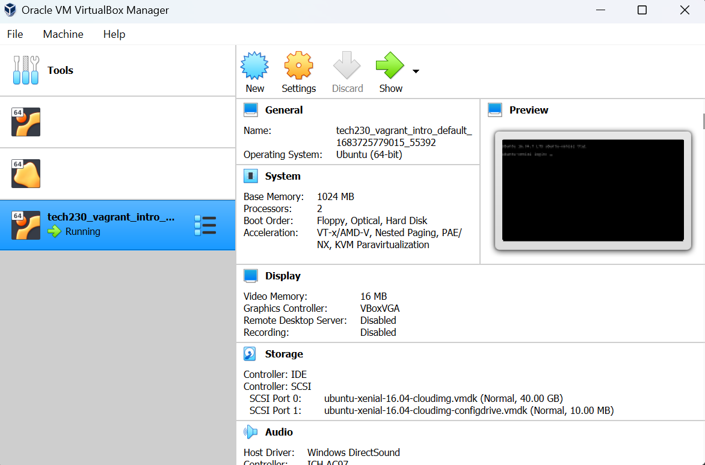

# Nginx Web Server Deployment using Vagrant

This guide will explain how to create an Ubuntu Virtual Machine (VM) using Vagrant and VirtualBox Manager, and use it to run an nginx web server.

Pre-requisties (for Windows):

- Install VirtualBox and run as **administrator**: [Oracle VirtualBox 6.1](https://www.virtualbox.org/wiki/Download_Old_Builds_6_1)
- Install Vagrant (AMD64 recommended): [HashiCorp Vagrant](https://developer.hashicorp.com/vagrant/downloads?product_intent=vagrant)
- Check Vagrant is installed by entering `vagrant` into a terminal.
- Install VSCode and run as **administrator**: [Visual Studio Code](https://code.visualstudio.com/download)

## Creating the Virtual Machine using Vagrant

1. Firstly, open a Git bash terminal window in VSCode and navigate to the desired folder where you want to create the VM.

2. Initialise the folder for Vagrant using the following command:

    ```console
    $ vagrant init
    ```

3. This should produce a file called 'Vagrantfile' where all the configuration information will be stored. Open the file and remove the comments so it looks similar to the below:

    ```ruby
    Vagrant.configure("2") do |config|
    
      config.vm.box = "base"
    
    end
    ```

4. Where it says `base`, enter the VM image type, in this case we are using Ubuntu so enter `ubuntu/xenial64`.

5. Also, we want to specify the IP address of the nginx web-server, so enter a new line under `config.vm.box` and type the following: `config.vm.network "private_network", ip:"192.168.10.100"`. Our 'Vagrantfile' should now look something like the below:

    ```ruby
    Vagrant.configure("2") do |config|
    
      config.vm.box = "ubuntu/xenial64"
      config.vm.network "private_network", ip:"192.168.10.100"
    
    end
    ```

6. Now, moving back to the terminal we can start the VM using the following command:

    ```console
    $ vagrant up
    ```

    If you open VirtualBox, you should now see the VM running, it should be titled the same as the folder you initialised it in.

    

7. To log in to the VM and use the VM's Linux terminal, enter the following command:

    ```console
    $ vagrant ssh
    ```

8. Now we are logged in, the username in the VSCode terminal should change to `vagrant@ubuntu-xenial` meaning you have successfully created and logged in to your new VM's Linux terminal! Now to deploy our first nginx web server...

## Deploying the Nginx Web Server

1. Firstly, use the following Linux commands to fetch updates for any packages that can be installed (`update`) and install such updates (`upgrade`).

    ```console
    $ sudo apt-get update
    $ sudo apt-get upgrade
    ```

    > **Note:** ensure you want to install these updates as it may be dangerous to do so. `-y` can be added to the end of the `upgrade` command to automatically bypass the 'Do you want to continue? [Y/n]' warning. In any case, enter 'y' to move on.

2. Next, install nginx which will be the software used to run the web server, using the command below:

    ```console
    $ sudo apt-get install nginx
    ```

3. To start the nginx web server, we can use the following `start` command and to check the status of the server we can use the `status` command, as follows:

    ```console
    $ sudo systemctl start nginx
    $ sudo systemctl status nginx
    ```

    > **Note:** if your command line disappears at this step, it may be because a text editor is displaying the status information, press 'q' to exit this and return to the command line.

4. To log out of the VM's Linux terminal, you can use the following command:

    ```console
    $ exit
    ```

5. Congratulations, you have successfully deployed your first web server. Enter the IP address '192.168.10.100' in a browser address bar to view the following nginx welcome page.

    

## Additional Vagrant Commands

- If you have made changes to a 'Vagrantfile' and want to reload the VM to display these changes you can run the following vagrant command:

    ```console
    $ vagrant reload
    ```

- If you have a VM already created by Vagrant, you can remove it using the following command:

    ```console
    $ vagrant destroy
    ```
    
## Glossary of Linux Commands

The following list is a glossary of useful Linux commands and information on file permissions that can be used when operating your Linux VM.

- To print the working directory:

    ```console
    $ pwd
    ```

- To list all visible files in the current working directory (use the `-l` flag to show more detail such as permissions and the `-a` flag to show hidden files e.g. `ls -al` will show detail of all visible and hidden files):

    ```console
    $ ls
    ```

  > **Note:** you can use a wildcard (`*`) to filter files e.g. `ls order*` will show files containing the word 'order'.

- To make a new file (add a full-stop/period at the start of the filename to make it hidden e.g. `.hidden-file`):

    ```console
    $ touch <file-name>
    ```

- To open a file:

    ```console
    $ file <file-name>
    ```

- To move a file:

    ```console
    $ mv <file-name> <destination-name>
    ```

- To display the contents of a file:

    ```console
    $ cat <file-name>
    ```

- To write simple text to a file:

    ```console
    $ echo "text" >> <file-name>
    ```

- To write more complex text to a file using the Nano text editor (it will also create a file and open it if you have not previously created a file):

    ```console
    $ sudo nano <file-name>
    ```

- To make a new directory (add a full-stop/period at the start of the directory name to make it hidden e.g. `.hidden-folder`):

    ```console
    $ mkdir <directory-name>
    ```

- To remove a file (use the `-f` flag to force remove a file regardless of file protection e.g. `rm -f protected-file`)

    ```console
    $ rm <file-name>
    ```

- To remove an empty directory:

    ```console
    $ rm -d <file-name>
    ```

- To remove a non-empty directory:

    ```console
    $ rm -r <file-name>
    ```

## Permissions

When performing an `ls -l` command, the permissions are shown on the left. The first character represents if the item is a file (`-`) or a directory (`d`) and the next 9 characters represent the permissions, where the first 3 characters are for the owner, the following 3 are for the group and the final 3 are for everyone else, as shown in the image below:


- Where:

  - r = Read only permissions

  - w = Write permissions

  - x = Execute/run permissions

- Example:

```console
-rw-r--r--  # file, read only for everyone and write for permission for owner
drwxrwxr-x  # directory, read and execute permissions for everyone and write for group and owner
```

### Change Permissions - Longhand

- To change the permissions of a file, use the following longhand command:

    ```console
    $ chmod <access-group>+<permissions> <file-name>
    ```

    > **Note:** access-group is a character representing the type of user (owner, group or everyone else) and permissions are the standard permissions written out e.g. `rwx` for read, write and execute

    **Longhand Permissions Character Codes:**

  - u = User/owner

  - g = Group

  - o = Others

  - a = All (or leave it blank)

- Example to give everyone full permissions to a file:

    ```console
    $ chmod a+rwx <file-name>
    ```

### Change Permissions - Shorthand

- You can also use a shorthand command to change permissions:

    ```console
    $ chmod <xyz> <file-name>
    ```

    > **Note:** x, y and z have digits between 0 and 7 to control the owner, group and everyone else's permissions respectively

    **Shorthand Permissions Number Codes:**

  - 0 - No permission

  - 1 - Execute permission

  - 2 - Write permission

  - 3 - Write and execute permissions

  - 4 - Read permission

  - 5 - Read and execute permissions

  - 6 - Read and write permissions

  - 7 - Read, write, and execute permissions

- Example to give everyone full permissions to a file:

    ```console
    $ chmod 777 <file-name>
    ```
